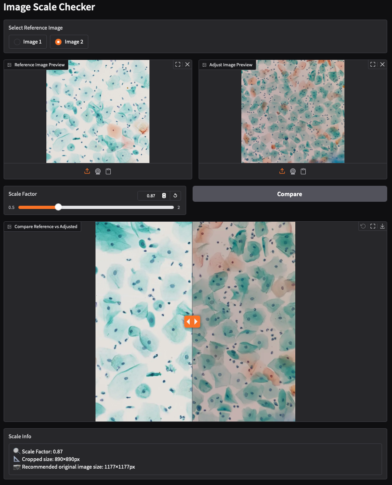
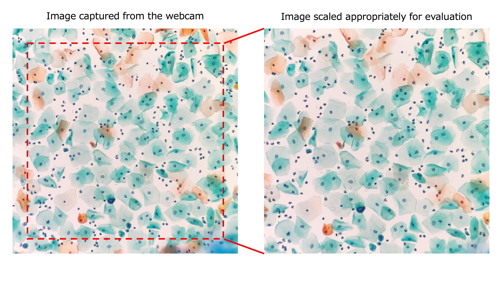

# Scale Checker
<div align="center">
  
</div>

|[日本語](./README_JA.md)|

## ✨ Overview
- Scale Checker is a tool designed to **visually check and adjust scale differences** between training images and camera-captured images when using CYTOLONE.
- By **displaying the reference image and camera image side by side** and adjusting the scale with a slider, you can **calculate the optimal camera input size**.

    <br>

    📝 Note: Why is this needed?  
    > The scale of input images may differ from training images depending on the microscope, lens type, iPhone model, and adapter. Using raw webcam images without adjustment can lead to inaccurate results.  
    > This tool helps you **calculate the appropriate cropping factor** for your iPhone camera input.

<br>

<div align="center">

<picture>
  
</picture> 

</div>

<br>

📝 Note:
> Currently, the only **verified setup** is **iPhone 15 × [i-NTER LENS](https://www.microscope-net.com/products/smartphone/inter-lens/)**.
> Please report other device combinations via **Issues**!

### 🚀 How to Launch the App
- Launch: 
    ```bash
    scale-check
    ```
    Access the URL displayed in the terminal using your web browser.  

- Modes
    - **Manual** tab:
        - Same workflow as before. Use the slider to match the nucleus size visually.
    - **Semi-Auto** tab:
        - Click one nucleus center in each image and estimate scale automatically.
        - Keep slider-based fine tuning before applying.
        - A cursor-following loupe is shown over both images. The loupe is an
          inspection aid only; the underlying image remains the single click
          target, so the reported click coordinates stay in source-image space.

- Semi-Auto Workflow
    1. Select a reference image.
    2. Capture/upload an input image with a 10x objective lens.
    3. On the reference image, use the 4–6× loupe and fixed center crosshair to click one **squamous epithelial nucleus center**.
    4. On the input image, use the loupe and center crosshair to click one **squamous epithelial nucleus center**.
    5. Confirm the extracted nucleus previews, including the click point and the adopted mask.
    6. If extraction fails or confidence is low, no diameter is returned; re-click another nucleus.
    7. Press **Estimate** to calculate scale.
    8. Fine-tune with the scale slider if needed.
    9. Press **Apply** to write `WEBCAM_IMAGE_SIZE` to `CYTOLONE/config.ini`.

📝 Important selection rule:
> Use only **squamous epithelial nuclei** as landmarks.
> **Exclude inflammatory cells** and overlapping cells.

- Output example
    > 🔍 Scale Factor: 0.87
    > 📐 Cropped size: 890×890px
    > 📷 Recommended original image size: 1177×1177px
    > Apply also shows the equivalent command:
    > ```bash
    > cytolone-config --WEBCAM_IMAGE_SIZE 1177
    > ```
