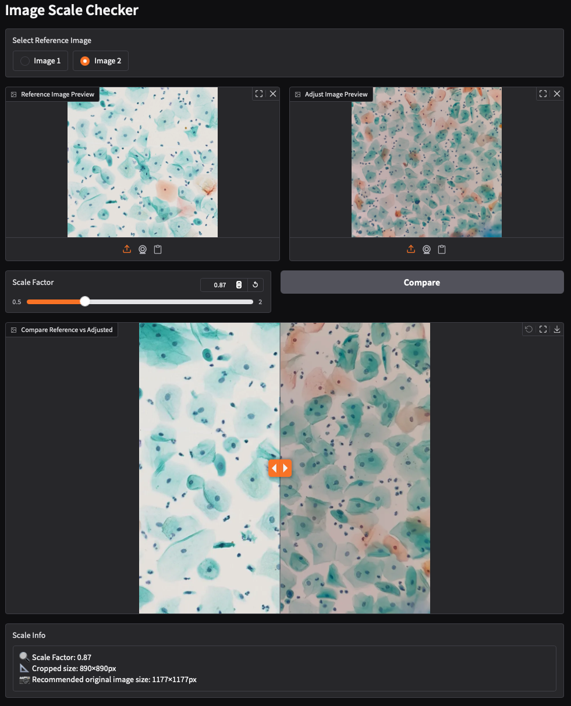
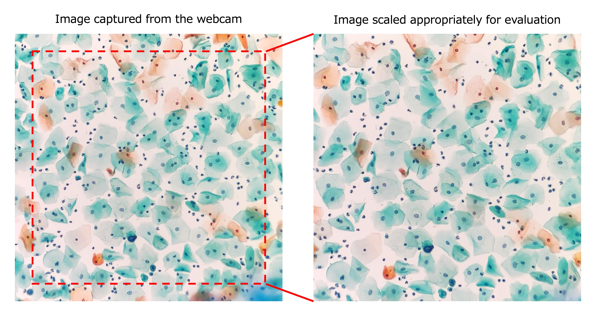

# Scale Checker
<div align="center">
  
</div>

## ✨ 概要
- Scale Checkerは、CYTOLONEを使用する際に「学習画像」と「カメラ画像」のスケールのズレを直感的に確認・調整するためのツールです。
- 基準画像とカメラ画像を並べて表示し、スライダーでスケールを調整しながら比較することで、最適なカメラ入力サイズを算出できます。

    <br>

    📝 Note: なぜ必要なの？  
    > 顕微鏡・レンズ・iPhoneの機種・アダプタの違いによって、入力画像とモデル学習時の画像スケールが異なります。そのままWebcam画像を判定に使うと、結果がブレる原因になります。  
    > そのため、iPhone画像を適切にクロップする必要があり、その係数を算出するのが本アプリです。

<br>

<div align="center">

<picture>
  
</picture> 

</div>

<br>

📝 Note:
> 現在、検証済みの組み合わせは
iPhone 15と[i-NTER LENS](https://www.microscope-net.com/products/smartphone/inter-lens/) のみです。
> その他の組み合わせはissueで報告してください！

### 🚀 アプリの起動
- 起動
    ```bash
    scale-check
    ```
    ターミナルに表示されたURLにWebブラウザからアクセスしてください。  

- モード
    - **Manual** タブ:
        - 従来どおりスライダーで見た目の核サイズを合わせて調整します。
    - **Semi-Auto** タブ:
        - 各画像で核中心を1クリックしてスケールを自動推定します。
        - 推定後はスライダーで微調整できます。

- Semi-Auto 操作手順
    1. 基準画像（Reference Image）を選択
    2. 10倍対物レンズの入力画像を撮影またはアップロード
    3. 基準画像で**扁平上皮核の中心**を1点クリック
    4. 入力画像で**扁平上皮核の中心**を1点クリック
    5. 核抽出プレビューを確認
    6. 抽出に失敗した場合は、別の核を再クリック
    7. **Estimate** を押してスケールを算出
    8. 必要に応じてスライダーで微調整
    9. **Apply** を押して `CYTOLONE/config.ini` の `WEBCAM_IMAGE_SIZE` に反映

📝 重要:
> 指標に使うのは **扁平上皮の核のみ** にしてください。
> **炎症細胞や重なり細胞は除外** してください。

- 出力例
    > 🔍 Scale Factor: 0.87
    > 📐 Cropped size: 890×890px
    > 📷 Recommended original image size: 1177×1177px
    > Apply時には同等コマンドも表示されます:
    > ```bash
    > cytolone-config --WEBCAM_IMAGE_SIZE 1177
    > ```
